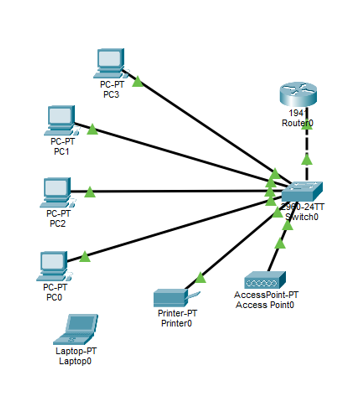
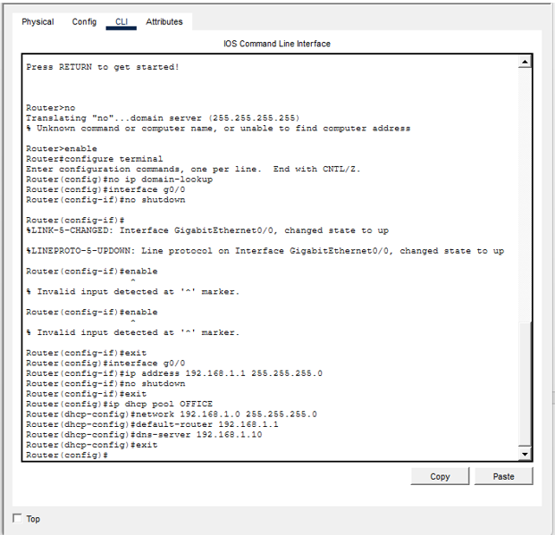
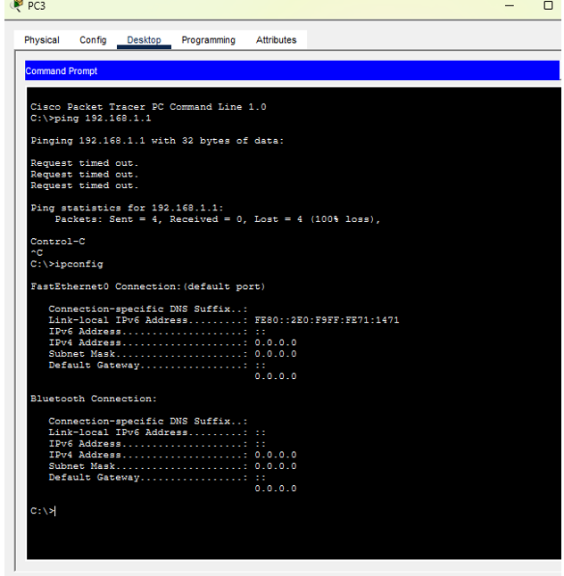
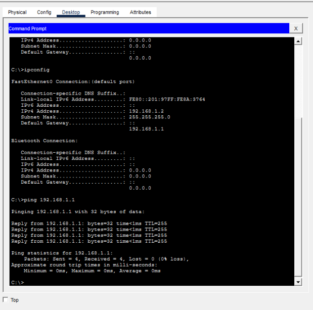

# Small Business Network with DHCP

## Project Overview
This project demonstrates the configuration of a small business network using Cisco Packet Tracer.  
The network includes a router, switch, wireless access point, printer, and multiple client devices.  
Dynamic Host Configuration Protocol (DHCP) was configured to automatically assign IP addresses to devices.

## Technologies Used
- Cisco Packet Tracer
- Cisco Router (1941)
- Cisco Switch (2960)
- DHCP
- IPv4 Addressing
- Basic Network Troubleshooting (ping, ipconfig)

## Commands Used
- enable
- configure terminal
- no ip domain-lookup

- interface g0/0
- ip address 192.168.1.1 255.255.255.0
- no shutdown
- exit

- ip dhcp pool OFFICE
- network 192.168.1.0 255.255.255.0
- default-router 192.168.1.1
- dns-server 192.168.1.10
- exit

## Network Topology
Below is the physical network layout used in this lab.

## Router Configuration
Configured the router interface and enabled DHCP services.

## DHCP Troubleshooting
Initially, devices could not obtain an IP address.  
After configuring the DHCP pool and enabling the interface, connectivity was restored.

## Successful Connectivity Test
All devices successfully received IP addresses and communicated with the default gateway.

## Key Skills Demonstrated
- DHCP configuration
- IP addressing
- Router and switch configuration
- Network troubleshooting
- Connectivity verification using ping
